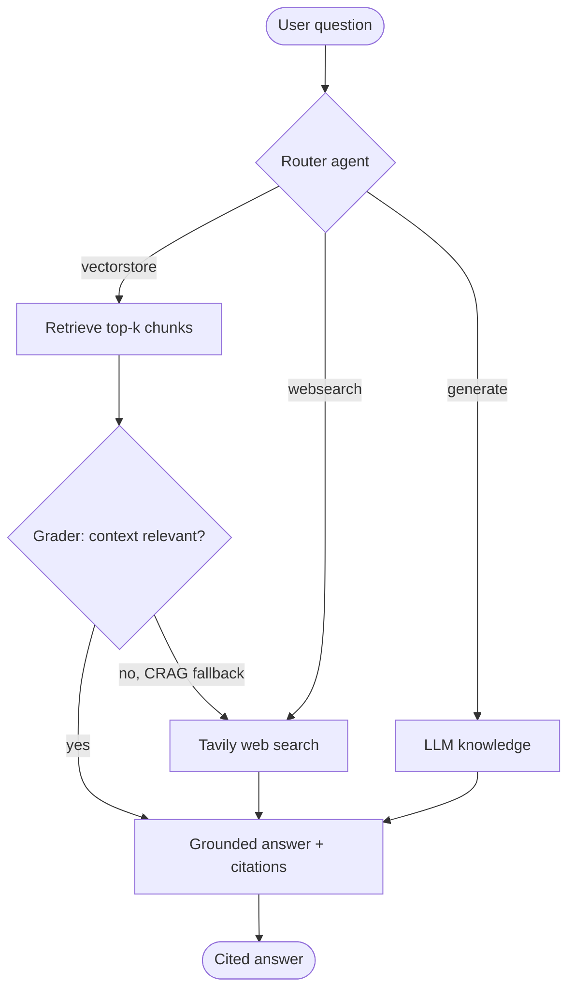

# 🤖 Agentic RAG

A production-quality, **multi-agent Retrieval-Augmented Generation** system built
with [CrewAI](https://github.com/crewAIInc/crewAI), ChromaDB and LiteLLM.

A user asks a question; an intelligent **router agent** decides whether to answer
from uploaded documents (vector store), a live **web search**, or the LLM's own
knowledge. A **retriever/answer agent** then produces a clear, **cited** answer.
A lightweight **grader** implements the *corrective-RAG (CRAG)* pattern: if the
retrieved documents don't actually answer the question, the system automatically
falls back to web search.

---

## ✨ Features

- **Agentic routing** — every question is classified into `vectorstore`,
  `websearch`, or `generate` using a structured (Pydantic) decision.
- **Corrective-RAG self-correction** — a grader checks retrieved context and
  triggers a web-search fallback when documents are insufficient.
- **Cited answers** — file name + page for documents, URLs for web results, and
  an honest *"I don't know"* instead of hallucinating.
- **Document ingestion** — upload multiple PDFs / `.txt` / `.md`, chunk with
  overlap, embed, and store in a **persistent ChromaDB** collection. Unchanged
  files are skipped via content hashing (no re-embedding).
- **Provider-agnostic** — switch between **OpenAI / Azure OpenAI / Groq** with
  only environment variables, via LiteLLM.
- **Two interfaces** — a **Streamlit** chat UI and a **FastAPI** `POST /ask`
  endpoint.
- **Conversation memory** — short-term chat history for follow-up questions.
- **Senior-grade engineering** — typed config, structured logging, full type
  hints + docstrings, offline unit tests, CI, Docker, and pre-commit.

---

## 🏗️ Architecture



### Component layout

```
src/agentic_rag/
  core/        # config (pydantic-settings), logging, LiteLLM provider layer
  ingestion/   # loaders, chunking, ChromaDB vector store, ingest pipeline
  tools/       # rag retrieval, web search (Tavily), answer generation
  agents/      # router, grader, crew orchestrator + YAML agent/task configs
  api/         # FastAPI app (POST /ask, /ingest, /stats, /health)
  ui/          # Streamlit chat app
tests/         # offline, fully-mocked pytest suite
```

---

## 🚀 Setup

This project uses [`uv`](https://docs.astral.sh/uv/) for dependency management.

```bash
# 1. Install uv (if needed)
#    https://docs.astral.sh/uv/getting-started/installation/

# 2. Install dependencies (incl. dev tools)
uv sync --extra dev

# 3. Configure environment
cp .env.example .env
#   then edit .env and set at least OPENAI_API_KEY
```

### Required environment variables

The system runs end-to-end with **only `OPENAI_API_KEY`** set. Everything else
has sensible defaults.

| Variable | Required? | Default | Purpose |
|---|---|---|---|
| `LLM_PROVIDER` | no | `openai` | `openai` \| `azure` \| `groq` |
| `LLM_MODEL` | no | `gpt-4o-mini` | Chat model (LiteLLM naming) |
| `EMBEDDING_MODEL` | no | `text-embedding-3-small` | Embedding model |
| `OPENAI_API_KEY` | **yes** (openai) | – | OpenAI key |
| `AZURE_API_KEY` / `AZURE_API_BASE` / `AZURE_API_VERSION` | if azure | – | Azure OpenAI |
| `GROQ_API_KEY` | if groq | – | Groq key |
| `TAVILY_API_KEY` | no | – | Enables live web search (graceful fallback if unset) |
| `CHROMA_PERSIST_DIR` | no | `./.chroma` | Vector DB location |
| `CHROMA_COLLECTION` | no | `agentic_rag` | Collection name |
| `DATA_DIR` | no | `./data` | Folder for dropped documents |
| `CHUNK_SIZE` / `CHUNK_OVERLAP` | no | `1000` / `150` | Chunking |
| `TOP_K` | no | `4` | Chunks retrieved per query |
| `GRADE_THRESHOLD` | no | `0.5` | CRAG relevance threshold |
| `LOG_LEVEL` | no | `INFO` | Logging level |
| `API_HOST` / `API_PORT` | no | `0.0.0.0` / `8000` | API binding |

See [.env.example](.env.example) for the fully-commented list.

---

## ▶️ Running

### Streamlit UI (chat + upload)

```bash
uv run streamlit run src/agentic_rag/ui/app.py
```

Open http://localhost:8501, upload a PDF in the sidebar, click **Index
documents**, then ask questions.

### FastAPI REST API

```bash
uv run uvicorn agentic_rag.api.main:app --reload
# or: uv run agentic-rag-api
```

Then:

```bash
curl -X POST http://localhost:8000/ask \
  -H "Content-Type: application/json" \
  -d '{"question": "What does the document say about X?"}'
```

Interactive docs: http://localhost:8000/docs

### Ingest the `data/` folder from the CLI

```bash
# Drop files into ./data, then:
uv run agentic-rag-ingest          # or: uv run agentic-rag-ingest --dir ./data
```

### Docker

```bash
docker compose up --build
# UI  -> http://localhost:8501
# API -> http://localhost:8000
```

---

## 🧭 The agentic routing flow

1. **Route** — the router agent classifies the question into one of three
   routes and returns a structured `RouteDecision` (route + reasoning +
   confidence). An offline heuristic backs up the LLM call.
2. **Retrieve** (`vectorstore`) — fetch the top-k most similar chunks from
   ChromaDB.
3. **Grade (CRAG)** — the grader scores whether the retrieved context actually
   answers the question. If the score is below `GRADE_THRESHOLD`, the system
   **falls back to web search** automatically.
4. **Answer** — generate a grounded answer that cites its sources (file + page
   or URL). If nothing supports an answer, it replies *"I don't know."*
5. **Memory** — recent turns are passed back in for follow-up questions.

---

## 💬 Example questions

| Question | Expected route |
|---|---|
| *"Summarize section 3 of the uploaded report."* | 📄 vectorstore |
| *"What's the latest news on AI regulation today?"* | 🌐 websearch |
| *"Explain how attention works in transformers."* | 🧠 generate |
| *"What does the document say about quantum gravity?"* (when docs are off-topic) | 📄 → 🌐 corrective fallback |

---

## 🧪 Tests & quality

```bash
uv run pytest                 # fully offline; no API keys needed
uv run ruff check .           # lint
uv run ruff format .          # format
uv run pre-commit install     # enable git hooks
```

CI runs ruff + pytest on every push/PR (see
[.github/workflows/ci.yml](.github/workflows/ci.yml)).

---

## 📁 Project structure

```
.
├── pyproject.toml            # uv / project metadata + ruff + pytest config
├── .env.example              # every env var, documented
├── Dockerfile / docker-compose.yml
├── .pre-commit-config.yaml
├── .github/workflows/ci.yml
├── data/                     # drop documents here
├── src/agentic_rag/          # application package
└── tests/                    # offline unit tests
```
